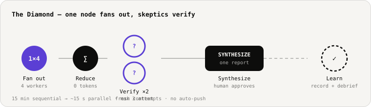
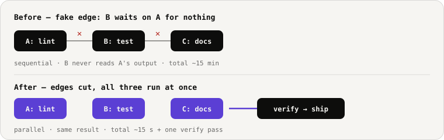

<div align="center">

# vibe-to-ship

**Your agent doesn't need more prompts. It needs a graph.**

[](LICENSE)
[](SKILL.md)
[](#install)
[](#quickstart)



</div>

`vibe-to-ship` is a single skill file that gives any coding agent the discipline to ship like a team. Drop it into your skills folder, ask for a triage, and your agent stops guessing and starts running a graph: bounded nodes, isolated worktrees, fresh-context verification, and a memory that survives between sessions.

Works with or without [OpenLotus](https://www.openlotus.io) — standalone when you want speed, supercharged when you want memory.

---

## You have already lived the problem

**One agent, one long vibe.** It is brilliant for twenty minutes. Then the context window fills, it forgets requirement #2, edits the wrong file, and tells you `All tests pass!` — without a compiler ever running. You find out at deploy.

**So you spawn five agents.** Now they share a chat history and agree with each other's mistakes. Two of them edit `page.tsx` in the same minute and the second silently overwrites the first. Nobody warns you, because nobody knows. You pay five times the tokens for a team that talks over itself.

**So you add a loop.** "Try, check, adjust, repeat" — with nothing anchoring it to reality. The agent retries a broken test fourteen times, burns $40 of credits, its `STATE.md` claims done while `git` says otherwise, and the loop never declares failure because nothing told it failure was an option.

None of this is a model problem. It is a structure problem. More prompts cannot fix it, and more agents amplify it.

`vibe-to-ship` replaces the structure: one node is one agent doing one job, with a contract for what enters and what leaves. Nodes that don't consume each other's output run in parallel. Nodes that do get checked by a fresh agent that has seen nothing but the artifact and the contract. Three failed attempts, then it stops and asks you.

That is the whole idea. The rest is making it automatic.

---

## The honest comparison

| | Single agent | Fleet of subagents | vibe-to-ship |
|---|---|---|---|
| **Context** | One window, forgotten past ~10 files | Shared chat — agents nod along to shared errors | Memory lives outside the model, in a tree you can see |
| **Parallelism** | None — every task queues behind the last | Chaotic — file collisions, silent overwrites | Git worktrees per worker — zero collisions |
| **Verification** | "All tests pass" (none were run) | Everyone agrees with everyone | Fresh-context skeptics + real compiler runs |
| **Failure mode** | Infinite loops, silent credit burn | Confident, wrong consensus | Capped at 3 attempts, then escalates to you |
| **Memory** | Lost with the chat window | Diluted across agents | One decision log every future session boots from |

---

## What your agent actually does

Every session runs the same beats, in order. Each beat's output is the next beat's input — so nothing depends on vibes.

| Beat | What happens | Guardrail |
|---|---|---|
| **0 · Setup** | Pairs OpenLotus, writes `mcp.json` + standing rules | Idempotent — never overwrites your config |
| **1 · Boot** | Loads the denylist, checks budget, connects memory | `.env`, `auth/`, `payments/`, `secrets/`, `credentials/`, `migrations/` untouchable |
| **2 · Triage** | Diffs what you *declared* against what `git` *observes* → **High / Watch / Noise** | Report-only. No files change. |
| **3 · Act** | Fans out nodes into isolated git worktrees; pure-code reduce dedupes | Node contracts — structured schemas, never free-text walls |
| **4 · Verify** | Fresh-context skeptic asks: correct? current? did tests *actually* pass? | 3 strikes → escalate to a human |
| **5 · Learn** | Records the decision + one-line debrief to the map | The next session boots with memory, not from zero |

---

## The Fake-Edge Test — where the speed comes from

Before the graph runs, it interrogates every arrow between jobs: *does job B actually read job A's output?* If nothing passes along the edge, the dependency is fake — it only exists because a plan was written top-to-bottom. Cut it, and those jobs run simultaneously.



In practice: lint, tests, and docs never read each other's output, but a naive plan runs them back-to-back for ~15 minutes. Cut the two fake edges and the wall time is the slowest job plus one verify pass. The same test is what catches two workers heading for the same file before the collision happens, not after.

**Fresh-context verifiers** are the other half. A worker and its checker never share a context window — the verifier sees only the artifact and the contract. An agent cannot nod along to itself in a different font.

**Reduce is code, not tokens.** Deduplication after the fan-out is deterministic scripting. Zero LLM cost, zero drift.

**Bounded, not brittle.** One graph, three tries, then a human. Always.

```
Goal
└─ Active Nodes
   ├─ Plans       — what you declared
   ├─ Decisions   — what you chose (record_decision)
   ├─ Actions     — what workers produced
   └─ State       — what reality says (get_reality)
```

If your project has state, the graph has a branch for it. If you use OpenLotus, that branch is live.

---

## Is the install worth your time?

The setup is one copy command. Here is what it buys, on the first day:

| Minute | What happens | What it costs you |
|---|---|---|
| 0 | `cp -r vibe-to-ship ~/.claude/skills/` | One command |
| 1 | You say: "Run vibe-to-ship triage on this repo" | One sentence |
| 2 | You get a **High / Watch / Noise** report — evidence-backed, nothing changed | Zero risk — triage is read-only |
| 3 | You pick one High item and say "go" | Zero risk until you say go |
| +30 min | The fix lands in a worktree, verified by an agent that never saw the worker's transcript | You reviewed one diff |

That is the trade: **two minutes of setup for a triage that reconciles your declared plan against actual git reality before anyone touches code.** If your repo is small and solo, you may not need this yet. If any of these are true, you are the target:

- A feature that touches more than three files
- A repo that *feels* done but has no proof it works
- A week where nothing shipped and you cannot name why
- An agent that has ever said "done" and was not
- Any time you want the plan proposed *before* code is written

**When not to install:** single-file, single-question tasks. The skill knows this too — if it finds nothing actionable, it stops in under 5k tokens. No burning credits to look busy.

---

## Quickstart

```bash
# 1. Drop it in — 60 seconds
cp -r vibe-to-ship ~/.claude/skills/      # Claude Code
cp -r vibe-to-ship .opencode/skills/      # opencode
npx skills add https://github.com/CyberTycoon/vibe-to-ship   # any agent

# 2. Ask your agent
"Run vibe-to-ship triage on this repo"
```

You get back a short, honest triage — and nothing changes until you say go:

```
High   — [auth-form-validation] email regex missing — contradicts dec-2208a1
High   — [ci-red] main failing on lint
Watch  — TODO count up 40% this week
Noise  — stale feature-flag comment (revisit Q4)
Next:  fan out [auth-form-validation] + [ci-red] in parallel — no shared files
```

Then add the standing rules so everyday memory works without invoking the skill:

```bash
cat vibe-to-ship/references/agent-rules-snippet.md >> AGENTS.md
# or CLAUDE.md — both work
```

New here? [`docs/QUICKSTART.md`](docs/QUICKSTART.md) has the 5-minute walkthrough.

---

## With OpenLotus — optional, stronger

Standalone, the skill is disciplined. With OpenLotus, it is *remembering*.

Four tools your agent can call, plus a live progress map you can see:

- `get_reality` — what's actually in the repo right now
- `get_drift` — where declared progress and observed reality diverge
- `get_memory` / `record_decision` — the shared tree your whole team sees

```bash
npx openlotus pair          # opens your browser, pick a project
# or just tell your agent:
"set up OpenLotus"          # Beat 0 does mcp.json + pairing + rules for you
```

No account required to try the skill. OpenLotus is a superpower, not a dependency.
[`references/openlotus-engine.md`](references/openlotus-engine.md) has the full contract.

---

## Safety

- Never edits `.env`, `auth/`, `payments/`, `secrets/`, `credentials/`, `migrations/` without explicit human approval
- Never pushes or merges without you
- Every file-writing node runs in its own worktree
- Every verify is a real compiler or test run, not a claim

---

## Scripts (no agent required)

POSIX shell helpers — no dependencies beyond `git`:

| Script | What it does | Safe in CI? |
|---|---|---|
| `./scripts/install.sh` | One-time setup: rules block, `mcp.json` hint, pairing check | Appends only, never overwrites |
| `./scripts/doctor.sh` | Readiness check — High / Watch / Noise, exit 1 if blocked | Yes — read-only |
| `./scripts/triage.sh` | Report-only reality check | Yes — read-only (try `--json`) |

---

## Repository map

```
vibe-to-ship/
├─ SKILL.md                            # the full operator guide — 6 beats, contracts, worked examples
├─ references/
│  ├─ agent-rules-snippet.md           # standing rules for AGENTS.md / CLAUDE.md
│  └─ openlotus-engine.md              # the OpenLotus MCP contract
├─ scripts/
│  ├─ install.sh · doctor.sh · triage.sh
├─ assets/                             # animated diagrams (this page)
├─ docs/QUICKSTART.md                  # 5-minute walkthrough
└─ LICENSE
```

---

## License

MIT — see [LICENSE](LICENSE). Contributions via PR. If it helped you ship, a star helps others find it.
